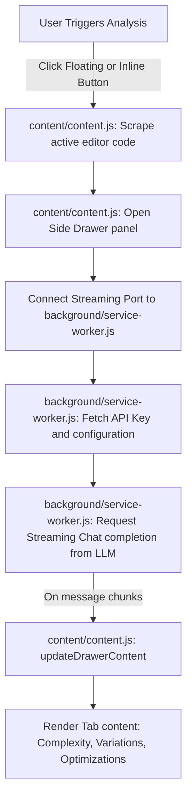

# Teach Leet
> A sleek, neomorphic dark-themed Chrome Extension that provides instant LeetCode code reviews and optimization suggestions directly in your browser.

## Workflow



---

## Features
* **Sleek Neomorphic Dark UI**: Implements a premium, modern dark mode interface with clean micro-interactions.
* **Streaming AI Reviews**: Streams code analysis response line-by-line using Gemini or custom API configurations.
* **Time & Space Complexity Badges**: Automatically extracts and displays the Big-O Time & Space complexities of your solution.
* **Alternative Variations**: Displays alternative approaches (Brute, Better, and Optimal) for comparison.
* **Step-by-step Optimizations**: Outlines concrete steps to transition to the optimal approach, including complete code blocks with copy-to-clipboard actions.

---

## Installation & Setup

1. **Clone the Repository**:
   ```bash
   git clone https://github.com/Mr-Smarty-331/Teach-Leet-.git
   cd Teach-Leet-
   ```

2. **Load the Extension into Chrome**:
   * Open Chrome and navigate to `chrome://extensions/`.
   * Enable **Developer mode** using the toggle switch in the top-right corner.
   * Click the **Load unpacked** button in the top-left.
   * Select the root directory of this project (`Leet - Analyze` / `Teach-Leet-`).

3. **Configure the API Key**:
   * Click on the **Teach Leet** extension icon in your Chrome toolbar.
   * Select your AI Provider (**Gemini** or **Custom** endpoints).
   * Enter your API Key and Model Name (e.g. `gemini-1.5-flash`), then click **Save Configuration**.

---

## How to Use

1. Go to any LeetCode problem page (e.g., [LeetCode 3Sum](https://leetcode.com/problems/3sum/)).
2. Click the floating **Analysis** button in the bottom-right corner of the window (or the **Analyze with AI** button injected next to your submission results).
3. The side review panel will slide in:
   * **Complexity Tab**: View your neomorphic complexity cards and structural explanation.
   * **Variations Tab**: Review alternative algorithmic strategies.
   * **Optimizations Tab**: Inspect optimized code templates for implementation steps.

---

## Project Structure
```text
├── background/
│   └── service-worker.js     # Background script handles streaming API requests
├── content/
│   ├── content.css           # Styling for the side drawer panels and floating buttons
│   └── content.js            # Main content script manages DOM scraping and UI injections
├── popup/
│   ├── popup.html            # Configuration settings popup markup
│   ├── popup.css             # Styling for the popup dialog settings
│   └── popup.js              # Script handles local storage persistence of configuration keys
└── manifest.json             # Manifest V3 extension configuration
```

---
*Created by [Amartya Raj](https://github.com/Mr-Smarty-331/)*
